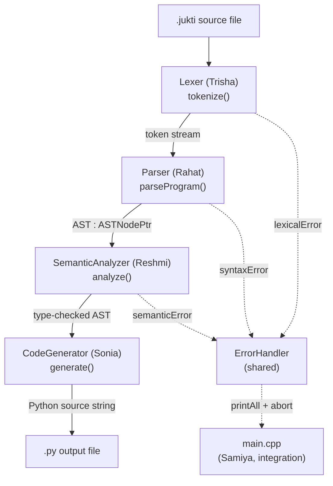
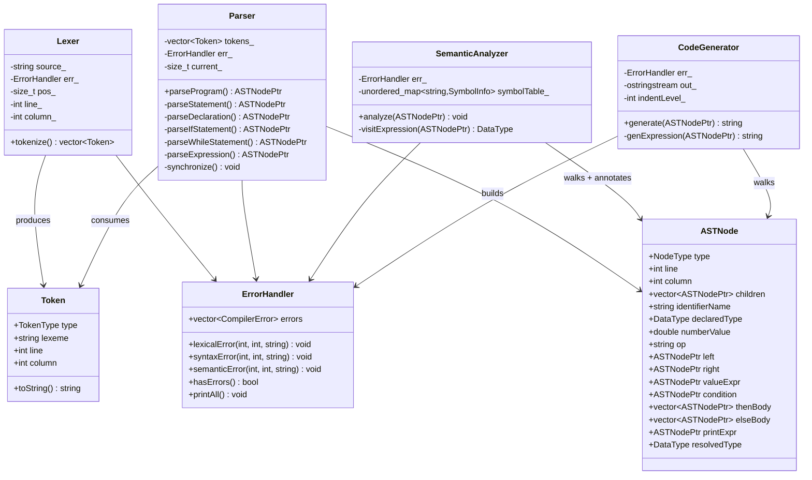
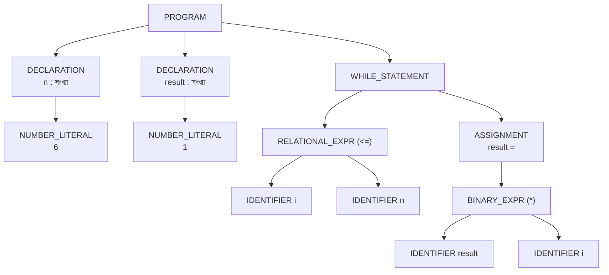

# JuktiLang — UML & Architecture Diagrams
## CSE-4114 Compiler Design and Construction Sessional

---

## 1. Compiler Pipeline (Activity Diagram)



Each phase reports through the same `ErrorHandler` instead of throwing past `main()`; `main.cpp` checks `err.hasErrors()` after every phase and stops before running a later phase on bad input.

---

## 2. Class / Struct Diagram



---

## 3. Why One `ASTNode` Struct Instead of a Class Hierarchy

An alternative design (used by some other teams) gives every node kind its own class — `DeclarationNode`, `IfNode`, `BinaryOpNode`, etc. — connected through a polymorphic base pointer. JuktiLang deliberately uses one flat `ASTNode` struct with a `NodeType` tag instead, because:

- **One header, frozen once.** The whole team could agree on `ast.h` in a single Phase 0 meeting and never touch it again — a class-per-node design would need every new node type coordinated across the person who parses it, the person who type-checks it, and the person who generates code from it.
- **No RTTI / `dynamic_cast` needed.** Every visitor (semantic, codegen) dispatches on a plain `switch (node->type)`, which is easier to get exhaustiveness-checked and to debug under time pressure.
- **Trade-off, acknowledged.** The struct carries fields that are irrelevant for most node kinds (e.g. `elseBody` is empty on every node except `IF_STATEMENT`). For a language this small the memory and clarity cost was judged acceptable in exchange for integration speed.

---

## 4. Example AST — `factorial.jukti`

Source (excerpt):
```
ধরি সংখ্যা n = 6;
ধরি সংখ্যা result = 1;
যতক্ষণ (i <= n) {
    result = result * i;
}
```

Resulting tree shape:


